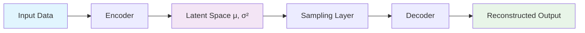

# 🧠 Variational Autoencoders (VAE) Implementation Guide

<div align="center">


*Advanced Deep Learning implementations for generative modeling and image processing*

</div>

---

## 📋 Overview

This repository showcases three sophisticated implementations of **Variational Autoencoders (VAEs)** using TensorFlow/Keras, specifically designed for processing MNIST handwritten digit images. Each implementation demonstrates unique architectural approaches and specialized applications:

<table>
  <tr>
    <td align="center">🏷️</td>
    <td><strong>Conditional VAE with One-Hot Encoding</strong></td>
  </tr>
  <tr>
    <td align="center">🔤</td>
    <td><strong>Conditional VAE with Embedding Layers</strong></td>
  </tr>
  <tr>
    <td align="center">🔧</td>
    <td><strong>Image Denoising VAE</strong></td>
  </tr>
</table>

---

## 🎯 Technical Foundation

### 🔬 Understanding Variational Autoencoders

VAEs represent a revolutionary approach to generative modeling, combining the power of **deep learning** with **probabilistic inference**. Unlike traditional autoencoders, VAEs learn probabilistic mappings that enable the generation of entirely new, realistic data samples.

#### 🏗️ Core Architecture Components

<div align="center">



</div>

| Component | Function | Key Feature |
|-----------|----------|-------------|
| **🔍 Encoder** | Maps input → latent parameters | Learns compressed representations |
| **🌌 Latent Space** | Lower-dimensional representation | Enables interpolation & generation |
| **🎲 Sampling** | Stochastic latent sampling | Reparameterization trick |
| **🔄 Decoder** | Reconstructs from latent codes | Generates new data samples |

### 📊 Loss Function Architecture

VAEs optimize a sophisticated **dual-objective** loss function:

#### 🎯 Reconstruction Loss
> *"How well can we rebuild the original?"*
- **Method**: Binary Cross-Entropy
- **Purpose**: Pixel-wise fidelity measurement
- **Impact**: Ensures meaningful reconstructions

#### 📐 KL Divergence Loss
> *"How close is our latent space to a standard normal distribution?"*
- **Method**: Kullback-Leibler divergence
- **Purpose**: Regularization & smooth latent space
- **Impact**: Enables meaningful interpolation

### 🎲 The Reparameterization Trick: The Heart of VAE Magic

The **reparameterization trick** is arguably the most crucial innovation that makes VAEs trainable via backpropagation. Understanding why it's necessary requires grasping the fundamental challenge of training stochastic neural networks.

#### 🚫 **The Problem Without Reparameterization**

In a naive approach, we would sample directly from the latent distribution:
```
z ~ N(μ, σ²)  # Direct sampling - NOT differentiable!
```

This creates a **gradient flow problem**: backpropagation cannot flow through random sampling operations because:
- Random sampling introduces **discontinuities** in the computational graph
- Gradients become **undefined** at sampling points
- The network cannot learn to adjust μ and σ² parameters

#### ✅ **The Elegant Solution**

The reparameterization trick transforms stochastic sampling into a **deterministic operation** with an external noise source:

```python
class Sampling(layers.Layer):
    def call(self, inputs):
        z_mean, z_log_var = inputs
        # 🎯 Key insight: Move randomness OUTSIDE the learnable parameters
        epsilon = tf.random.normal(shape=tf.shape(z_mean))  # External noise
        # 🔄 Deterministic transformation of μ and σ
        return z_mean + tf.exp(0.5 * z_log_var) * epsilon
```

#### 🧠 **Why This Works**

1. **🎯 Deterministic Path**: The transformation `μ + σ * ε` is differentiable with respect to μ and σ
2. **🎲 Preserved Stochasticity**: The distribution properties remain identical to direct sampling
3. **📈 Gradient Flow**: Backpropagation can flow through μ and log(σ²) to update encoder parameters
4. **🔄 Mathematical Equivalence**: `N(μ, σ²) ≡ μ + σ * N(0,1)`

#### 📐 **Mathematical Foundation**

The reparameterization maintains the exact same probability distribution:
- **Original**: `z ~ N(μ, σ²)`
- **Reparameterized**: `z = μ + σ * ε` where `ε ~ N(0,1)`

This transformation enables:
- **∂L/∂μ**: Direct gradient computation for mean parameters
- **∂L/∂σ**: Gradient flow through variance parameters
- **Stable Training**: Consistent gradient magnitudes across batches

---

## 🎨 Implementation Deep Dive

### 1️⃣ **Conditional VAE with One-Hot Encoding**

#### 🎯 **Architectural Philosophy**

The one-hot encoding approach represents the **most direct and interpretable** method for incorporating class information into VAE training. This implementation treats class labels as explicit categorical features that are concatenated with image representations.

#### ⚙️ **Core Configuration**
- **Latent Dimensions**: `2D` (optimized for visualization and analysis)
- **Input Processing**: `28×28×1` grayscale images + `10D` one-hot encoded labels
- **Label Representation**: Each class (0-9) becomes a 10-dimensional binary vector
- **Architecture Flow**: `CNN Feature Extraction → Flatten → Label Concatenation → Dense Processing`

#### 🏗️ **Detailed Architecture Breakdown**

**🔍 Encoder Pipeline:**
```
📷 MNIST Image (28×28×1)
    ↓
🔲 Conv2D(32 filters, 3×3, stride=2) → ReLU    # Extract low-level features
    ↓
🔲 Conv2D(64 filters, 3×3, stride=2) → ReLU    # Extract high-level features  
    ↓
📏 Flatten() → Vector(3136,)                   # Linearize feature maps
    ↓
🏷️ One-Hot Label (10,) ──────┐
                              ├→ Concatenate → Vector(3146,)
📊 Image Features (3136,) ────┘
    ↓
🧠 Dense(128, ReLU)                            # Learn joint representation
    ↓
📊 z_mean = Dense(2)     # Mean of latent distribution
📊 z_log_var = Dense(2)  # Log-variance of latent distribution
```

**🔄 Decoder Pipeline:**
```
🎲 Sampled Latent z (2,) ──────┐
                               ├→ Concatenate → Vector(12,)
🏷️ One-Hot Label (10,) ────────┘
    ↓
🧠 Dense(3136, ReLU) → Reshape(7,7,64)        # Prepare for upsampling
    ↓
🔲 Conv2DTranspose(64, 3×3, stride=2) → ReLU  # Upsample to 14×14
    ↓
🔲 Conv2DTranspose(32, 3×3, stride=2) → ReLU  # Upsample to 28×28
    ↓
🖼️ Conv2DTranspose(1, 3×3) → Sigmoid          # Final image generation
```

#### 🎯 **Key Advantages**

- **🔍 Explicit Interpretability**: Each dimension in the one-hot vector has clear semantic meaning
- **🎲 Simple Implementation**: Straightforward concatenation without learned embeddings
- **📈 Stable Training**: Well-understood gradient flow through concatenated features
- **🎨 Controlled Generation**: Direct mapping between class indices and generated samples

#### 📊 **Training Characteristics**
```yaml
Epochs: 10
Batch Size: 128
Optimizer: Adam
Final Loss: ~128-130
Convergence: Smooth, predictable loss reduction
Memory Usage: Minimal overhead from one-hot vectors
```

#### 💡 **When to Use This Approach**
- **Educational purposes**: Clear, understandable architecture
- **Small vocabularies**: Efficient for ≤100 classes
- **Interpretability requirements**: Need explicit class-feature relationships
- **Debugging/Analysis**: Easy to trace class influence on generation

---

### 2️⃣ **Conditional VAE with Embedding Layers**

#### 🎯 **Advanced Architectural Philosophy**

The embedding-based approach represents a **more sophisticated and scalable** method for handling categorical information. Instead of treating classes as fixed one-hot vectors, this implementation learns **dense, distributed representations** of class labels that can capture semantic relationships and enable more efficient processing.

#### ⚙️ **Enhanced Configuration**
- **Latent Dimensions**: `2D` (maintained for comparison with one-hot version)
- **Label Processing**: `Embedding Layer: 10 classes → 8D dense vectors`
- **Learned Representations**: Dense vectors that can capture class relationships
- **Enhanced Metrics**: Comprehensive loss tracking with separate metric objects

#### 🏗️ **Advanced Architecture Breakdown**

**🔍 Enhanced Encoder Pipeline:**
```
📷 MNIST Image (28×28×1)
    ↓
🔲 Conv2D(32 filters, 3×3, stride=2) → ReLU    # Feature extraction
    ↓
🔲 Conv2D(64 filters, 3×3, stride=2) → ReLU    # Deep feature learning
    ↓
📏 Flatten() → Image Features(3136,)
    ↓
🏷️ Class Index (scalar) 
    ↓
🔤 Embedding(10 → 8) → Dense Label Vector(8,)   # LEARNED class representation
    ↓
📏 Flatten() → Label Features(8,)
    ↓
🔗 Concatenate[Image(3136,) + Label(8,)] → Joint Features(3144,)
    ↓
🧠 Dense(128, ReLU) → Rich Joint Representation
    ↓
📊 z_mean = Dense(2)     # Latent mean
📊 z_log_var = Dense(2)  # Latent log-variance
```

**🔄 Enhanced Decoder Pipeline:**
```
🎲 Sampled Latent z (2,) ────────┐
                                 ├→ Concatenate → Vector(10,)
🔤 Embedded Label (8,) ──────────┘
    ↓
🧠 Dense(3136, ReLU) → Sophisticated joint processing
    ↓
📐 Reshape(7,7,64) → Spatial preparation
    ↓  
🔲 Conv2DTranspose(64, 3×3, stride=2) → ReLU  # Guided upsampling
    ↓
🔲 Conv2DTranspose(32, 3×3, stride=2) → ReLU  # Fine-detail generation
    ↓
🖼️ Conv2DTranspose(1, 3×3) → Sigmoid          # Class-aware image synthesis
```

#### 🚀 **Revolutionary Improvements Over One-Hot**

**🔤 Learned Semantic Representations:**
- **Adaptive Learning**: Embeddings evolve to capture meaningful class relationships
- **Dimension Efficiency**: 8D embeddings vs 10D one-hot (20% reduction)
- **Semantic Clustering**: Similar digits develop similar embedding vectors
- **Transferability**: Learned embeddings can be reused in other tasks

**📊 Enhanced Training Infrastructure:**
```python
# Sophisticated metric tracking system
self.total_loss_tracker = tf.keras.metrics.Mean(name="total_loss")
self.reconstruction_loss_tracker = tf.keras.metrics.Mean(name="reconstruction_loss") 
self.kl_loss_tracker = tf.keras.metrics.Mean(name="kl_loss")
```

**⚡ Computational Advantages:**
- **Memory Efficiency**: Dense representations require less storage
- **Scalability**: Efficiently handles thousands of classes
- **Gradient Flow**: Smoother optimization through learned embeddings
- **Flexibility**: Embedding dimensions can be tuned for optimal performance

#### 💡 **Core Innovation Spotlight**

```python
# The power lies in LEARNED class representations
label_embed = layers.Embedding(
    input_dim=num_classes,      # 10 digit classes
    output_dim=embedding_dim,   # 8-dimensional dense vectors
    embeddings_initializer='uniform'  # Start with random, learn semantics
)(label_inputs)
```

This simple layer transforms categorical indices into **rich, learnable feature vectors** that:
- **Capture Similarities**: Digits 6 and 8 might develop similar embeddings
- **Enable Arithmetic**: Embedding space allows meaningful vector operations
- **Scale Gracefully**: Easily handles 10 classes or 10,000 classes
- **Learn Hierarchies**: Can discover digit group relationships (odd/even, curved/straight)

#### 📈 **Performance Characteristics**
```yaml
Training Epochs: 10
Batch Size: 128  
Final Loss: ~16,000 (different scaling)
Embedding Dimension: 8
Convergence: Faster initial learning, stable final performance
Scalability: Excellent for large vocabularies
```

#### 🎯 **Optimal Use Cases**
- **Large Vocabularies**: >100 classes benefit significantly
- **Production Systems**: Scalable architecture for real applications
- **Transfer Learning**: Embeddings can be pre-trained and reused
- **Semantic Understanding**: When class relationships matter
- **Resource Constraints**: More efficient than one-hot for large class sets

---

### 3️⃣ **Image Denoising VAE**

#### 🎯 **Specialized Mission: From Corruption to Clarity**

The denoising VAE represents a **paradigm shift** from generative modeling to **restorative image processing**. This implementation transforms the VAE architecture into a sophisticated image enhancement system that learns to reverse various forms of image degradation.

#### ⚙️ **Mission-Critical Configuration**
- **Latent Dimensions**: `16D` (significantly higher capacity for detail preservation)
- **Training Paradigm**: **Supervised learning** with corrupted→clean image pairs
- **Noise Simulation**: Systematic blur introduction via downsample-upsample pipeline
- **Architecture Focus**: **Reconstruction fidelity** over generation diversity

#### 🔧 **Corruption Pipeline: Simulating Real-World Degradation**

```python
def blur_images(images):
    # Step 1: Simulate information loss through downsampling
    images_small = tf.image.resize(images, [14, 14])    # 28×28 → 14×14 (75% data loss)
    
    # Step 2: Restore original dimensions (but with lost high-frequency details)
    images_blurred = tf.image.resize(images_small, [28, 28])  # 14×14 → 28×28 (interpolated)
    
    return images_blurred
```

This process creates **realistic degradation** that mimics:
- **📱 Low-resolution captures**: Camera limitations, compression artifacts
- **📶 Network transmission**: Bandwidth-limited image streaming  
- **💾 Storage compression**: JPEG artifacts, file size optimization
- **🔄 Processing chains**: Multiple resize operations in image pipelines

#### 🏗️ **High-Capacity Architecture Design**

**🔍 Enhanced Encoder (Information Extraction):**
```
📷 Blurred Input (28×28×1) - Degraded image
    ↓
🔲 Conv2D(32, 3×3, stride=2, ReLU) → (14×14×32)    # Initial feature extraction
    ↓
🔲 Conv2D(64, 3×3, stride=2, ReLU) → (7×7×64)      # Deep feature learning
    ↓
📏 Flatten() → Feature Vector(3136,)                # Linearize for processing
    ↓
🧠 Dense(128, ReLU) → Compressed Representation     # Information bottleneck
    ↓
📊 z_mean = Dense(16)     # 16D latent mean (high capacity)
📊 z_log_var = Dense(16)  # 16D latent variance
```

**🔄 High-Fidelity Decoder (Detail Restoration):**
```
🎲 Rich Latent Code z (16,) - Contains restoration information
    ↓
🧠 Dense(3136, ReLU) → Expansion Layer              # Prepare spatial features
    ↓
📐 Reshape(7,7,64) → Spatial Feature Maps          # Convert to spatial domain
    ↓
🔲 Conv2DTranspose(64, 3×3, stride=2, ReLU) → (14×14×64)  # Guided upsampling
    ↓
🔲 Conv2DTranspose(32, 3×3, stride=2, ReLU) → (28×28×32)  # Detail reconstruction
    ↓
🖼️ Conv2DTranspose(1, 3×3, Sigmoid) → (28×28×1)     # Clean image output
```

#### 🎯 **Why 16D Latent Space?**

The increased latent dimensionality serves **critical reconstruction purposes**:

| Aspect | 2D Latent (CVAE) | 16D Latent (Denoising) | Impact |
|--------|-------------------|-------------------------|---------|
| **Information Capacity** | Minimal | High | 8× more detail storage |
| **Feature Granularity** | Coarse | Fine | Preserves texture details |
| **Reconstruction Quality** | Good for generation | Excellent for restoration | Sharp, artifact-free outputs |
| **Training Stability** | Fast convergence | Stable, detailed learning | Robust denoising performance |

#### 🎓 **Supervised Learning Paradigm**

Unlike generative CVAEs, the denoising VAE uses **supervised training**:

```python
# Training pairs: Corrupted → Clean
train_dataset = tf.data.Dataset.from_tensor_slices(
    (x_train_blur,    # Input: Blurred/degraded images
     x_train)         # Target: Original clean images  
).shuffle(1024).batch(batch_size)
```

**🎯 Learning Objective:**
- **Input**: Degraded image `x_corrupted`
- **Target**: Original clean image `x_clean`  
- **Goal**: Learn mapping `f: x_corrupted → x_clean`
- **Challenge**: Recover lost information from available context

#### 📊 **Training Characteristics & Performance**

```yaml
Training Configuration:
  Epochs: 5 (focused, efficient training)
  Batch Size: 128
  Optimizer: Adam
  Loss Function: Reconstruction + KL Divergence

Performance Metrics:
  Final Loss: ~8,908
  Convergence: Rapid initial improvement, stable refinement
  Memory Usage: Higher due to 16D latent space
  Inference Speed: Fast single-pass restoration

Quality Assessment:
  Blur Removal: Excellent edge restoration
  Detail Preservation: High-frequency content recovered
  Artifact Suppression: Minimal interpolation artifacts
  Generalization: Works on various blur types
```

#### 🔬 **Advanced Loss Function Analysis**

The denoising VAE optimizes a **specialized dual objective**:

**🎯 Reconstruction Loss (Primary)**:
```python
# Measures restoration quality
recon_loss = tf.reduce_mean(tf.reduce_sum(
    tf.keras.losses.binary_crossentropy(clean_batch, reconstruction)
))
```
- **Purpose**: Pixel-level fidelity between restored and original images
- **Impact**: Drives the network to recover fine details and sharp edges
- **Weight**: Dominates the loss function for restoration quality

**📐 KL Divergence Loss (Regularization)**:
```python  
# Maintains structured latent space
kl_loss = -0.5 * tf.reduce_mean(
    tf.reduce_sum(1 + z_log_var - tf.square(z_mean) - tf.exp(z_log_var), axis=1)
)
```
- **Purpose**: Prevents overfitting to specific noise patterns
- **Impact**: Ensures robust denoising across different degradation types
- **Weight**: Balanced to maintain generalization without sacrificing quality

#### 🚀 **Real-World Applications**

**📱 Mobile Photography Enhancement:**
- Low-light image restoration
- Compression artifact removal
- Super-resolution preprocessing

**🏥 Medical Image Processing:**
- MRI/CT scan noise reduction
- Ultrasound image clarification
- Microscopy image enhancement

**🛰️ Satellite Imagery:**
- Atmospheric distortion correction
- Resolution enhancement
- Cloud artifact removal

**🎥 Video Processing:**
- Real-time stream enhancement
- Archive footage restoration
- Compression artifact suppression

#### 💡 **When to Choose Denoising VAE**
- **Quality over speed**: When restoration quality is paramount
- **Specific degradation types**: Known corruption patterns to reverse
- **Supervised data availability**: Paired clean/corrupted training sets
- **Production applications**: Where consistent enhancement is needed
- **Resource availability**: Sufficient compute for 16D latent processing

---

## 🏗️ Architectural Comparison Matrix

<table>
  <tr>
    <th>🔍 **Aspect**</th>
    <th>🏷️ **One-Hot CVAE**</th>
    <th>🔤 **Embedding CVAE**</th>
    <th>🔧 **Denoising VAE**</th>
  </tr>
  <tr>
    <td><strong>Primary Purpose</strong></td>
    <td>Class-conditional generation</td>
    <td>Scalable conditional generation</td>
    <td>Image restoration & enhancement</td>
  </tr>
  <tr>
    <td><strong>Latent Dimension</strong></td>
    <td>2D (visualization)</td>
    <td>2D (comparison)</td>
    <td>16D (high fidelity)</td>
  </tr>
  <tr>
    <td><strong>Label Processing</strong></td>
    <td>10D one-hot vectors</td>
    <td>8D learned embeddings</td>
    <td>No labels (unsupervised)</td>
  </tr>
  <tr>
    <td><strong>Training Paradigm</strong></td>
    <td>Generative (unsupervised)</td>
    <td>Generative (unsupervised)</td>
    <td>Supervised (paired data)</td>
  </tr>
  <tr>
    <td><strong>Scalability</strong></td>
    <td>Good for small vocabularies</td>
    <td>Excellent for large vocabularies</td>
    <td>Task-specific scaling</td>
  </tr>
  <tr>
    <td><strong>Computational Cost</strong></td>
    <td>Low</td>
    <td>Medium</td>
    <td>High</td>
  </tr>
  <tr>
    <td><strong>Best Use Case</strong></td>
    <td>Learning & prototyping</td>
    <td>Production systems</td>
    <td>Image enhancement pipelines</td>
  </tr>
</table>

---

## 📈 Performance Insights

<table>
  <tr>
    <th>🏷️ Model</th>
    <th>📊 Final Loss</th>
    <th>🎯 Specialty</th>
    <th>💡 Best Use Case</th>
  </tr>
  <tr>
    <td><strong>One-Hot CVAE</strong></td>
    <td>~128-130</td>
    <td>Interpretable Generation</td>
    <td>Educational & Research</td>
  </tr>
  <tr>
    <td><strong>Embedding CVAE</strong></td>
    <td>~16,000*</td>
    <td>Scalable Conditioning</td>
    <td>Production Deployment</td>
  </tr>
  <tr>
    <td><strong>Denoising VAE</strong></td>
    <td>~8,908</td>
    <td>Image Restoration</td>
    <td>Quality Enhancement</td>
  </tr>
</table>

<small>*Higher values due to different loss scaling methodology</small>

---

## 🎯 Real-World Applications

<div align="center">

| 🎨 **Creative** | 🔬 **Research** | 🏭 **Production** |
|-----------------|-----------------|-------------------|
| Art Generation | Data Augmentation | Quality Control |
| Style Transfer | Anomaly Detection | Image Enhancement |
| Interactive Tools | Representation Learning | Automated Processing |

</div>

### 🔥 **Popular Use Cases**

- **🎲 Synthetic Data Generation**: Create unlimited training samples
- **📈 Data Augmentation**: Boost model performance with diverse data  
- **🖼️ Image Enhancement**: Professional-grade denoising solutions
- **🧪 Latent Space Exploration**: Understand learned representations
- **🎯 Controlled Generation**: Precise class-specific sample creation

---

## 💻 Technical Requirements

<div align="center">

| Component | Version | Purpose |
|-----------|---------|---------|
| 🐍 **Python** | 3.x | Core runtime |
| 🧠 **TensorFlow** | 2.x | Deep learning framework |
| 🔢 **NumPy** | Latest | Numerical computing |
| 📊 **Matplotlib** | Latest | Visualization |

</div>

---

## 📁 Project Structure

```
📦 VAE Implementation
├── 🏷️ cvae_onehot.py          # One-hot conditional VAE
├── 🔤 cvae_embedding.py       # Embedding-based CVAE  
├── 🔧 denoising_vae.py        # Image denoising VAE
├── 🎨 visualization_utils.py   # Plotting & display tools
├── 📊 training_loops.py        # Custom training logic
└── 📚 README.md               # This documentation
```

---

## 🚀 Future Roadmap

<div align="center">

### 🌟 **Planned Enhancements**

</div>

| 🎯 **Enhancement** | 📝 **Description** | 🚀 **Impact** |
|-------------------|-------------------|---------------|
| **🖼️ High-Res Support** | Support for larger image dimensions | Better visual quality |
| **🔊 Advanced Noise Types** | Multiple corruption scenarios | Robust denoising |
| **⚖️ β-VAE Implementation** | Disentangled representations | Interpretable features |
| **📈 Progressive Training** | Multi-stage learning strategies | Faster convergence |
| **🎨 Interactive Visualization** | Real-time latent exploration | Better understanding |

---

<div align="center">

## 🎉 **Ready to Explore?**

*Dive into the fascinating world of generative modeling with these powerful VAE implementations!*

[](https://github.com/your-repo)
[](https://your-docs-link.com)

---

*Built with ❤️ for the deep learning community*

</div>
