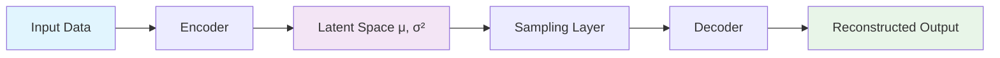

# 🧠 Variational Autoencoders (VAE) Implementation Guide

<div align="center">


*Advanced Deep Learning implementations for generative modeling and image processing*

</div>

---

## 📋 Overview

This repository showcases three sophisticated implementations of **Variational Autoencoders (VAEs)** using TensorFlow/Keras, specifically designed for processing MNIST handwritten digit images. Each implementation demonstrates unique architectural approaches and specialized applications:

<table>
  <tr>
    <td align="center">🏷️</td>
    <td><strong>Conditional VAE with One-Hot Encoding</strong></td>
  </tr>
  <tr>
    <td align="center">🔤</td>
    <td><strong>Conditional VAE with Embedding Layers</strong></td>
  </tr>
  <tr>
    <td align="center">🔧</td>
    <td><strong>Image Denoising VAE</strong></td>
  </tr>
</table>

---

## 🎯 Technical Foundation

### 🔬 Understanding Variational Autoencoders

VAEs represent a revolutionary approach to generative modeling, combining the power of **deep learning** with **probabilistic inference**. Unlike traditional autoencoders, VAEs learn probabilistic mappings that enable the generation of entirely new, realistic data samples.

#### 🏗️ Core Architecture Components

<div align="center">



</div>

| Component | Function | Key Feature |
|-----------|----------|-------------|
| **🔍 Encoder** | Maps input → latent parameters | Learns compressed representations |
| **🌌 Latent Space** | Lower-dimensional representation | Enables interpolation & generation |
| **🎲 Sampling** | Stochastic latent sampling | Reparameterization trick |
| **🔄 Decoder** | Reconstructs from latent codes | Generates new data samples |

### 📊 Loss Function Architecture

VAEs optimize a sophisticated **dual-objective** loss function:

#### 🎯 Reconstruction Loss
> *"How well can we rebuild the original?"*
- **Method**: Binary Cross-Entropy
- **Purpose**: Pixel-wise fidelity measurement
- **Impact**: Ensures meaningful reconstructions

#### 📐 KL Divergence Loss
> *"How close is our latent space to a standard normal distribution?"*
- **Method**: Kullback-Leibler divergence
- **Purpose**: Regularization & smooth latent space
- **Impact**: Enables meaningful interpolation

---

## 🎨 Implementation Showcase

### 1️⃣ **Conditional VAE with One-Hot Encoding**

<details>
<summary><strong>🔍 Click to explore architecture details</strong></summary>

#### ⚙️ **Configuration**
- **Latent Dimensions**: `2D` (optimized for visualization)
- **Input Processing**: `28×28×1` grayscale + `10D` one-hot labels
- **Architecture Flow**: `CNN → Flatten → Label Concat → Dense`

#### 🎯 **Key Features**
- ✅ Explicit one-hot label encoding
- ✅ 2D latent space for intuitive visualization
- ✅ Custom training loop with manual gradients
- ✅ Direct class-conditional generation

#### 📈 **Training Specs**
```yaml
Epochs: 10
Batch Size: 128
Optimizer: Adam
Final Loss: ~128-130
```

</details>

---

### 2️⃣ **Conditional VAE with Embedding Layers**

<details>
<summary><strong>🔍 Click to explore enhanced architecture</strong></summary>

#### ⚙️ **Advanced Configuration**
- **Latent Dimensions**: `2D`
- **Label Processing**: `Embedding(10 → 8D)`
- **Enhanced Metrics**: Comprehensive loss tracking

#### 🚀 **Improvements Over Version 1**
- ⭐ **Efficient Embeddings**: Learned label representations
- ⭐ **Better Integration**: Seamless label-feature fusion  
- ⭐ **Enhanced Monitoring**: Advanced metric tracking
- ⭐ **Scalability**: More efficient for larger vocabularies

#### 💡 **Core Innovation**
```python
# Intelligent label processing
label_embed = layers.Embedding(
    input_dim=num_classes, 
    output_dim=embedding_dim
)(label_inputs)
```

</details>

---

### 3️⃣ **Image Denoising VAE**

<details>
<summary><strong>🔍 Click to explore denoising capabilities</strong></summary>

#### ⚙️ **Specialized Configuration**
- **Latent Dimensions**: `16D` (high reconstruction capacity)
- **Training Paradigm**: Supervised denoising
- **Noise Simulation**: Blur via downsample-upsample

#### 🎯 **Denoising Pipeline**
1. **Corruption**: `28×28 → 14×14 → 28×28` (artificial blur)
2. **Learning**: Blurred input → Clean output mapping
3. **Reconstruction**: High-fidelity image restoration

#### 📊 **Performance Metrics**
```yaml
Training Epochs: 5
Batch Size: 128
Final Loss: ~8,908
Denoising Quality: Excellent blur removal
```

</details>

---

## 🏗️ Architectural Deep Dive

### 🔍 **Encoder Architecture Pattern**

<div align="center">

```
📷 Input (28×28×1) 
    ↓
🔲 Conv2D(32, 3×3, stride=2) 
    ↓
🔲 Conv2D(64, 3×3, stride=2)
    ↓
📏 Flatten 
    ↓
🔗 [Label Concatenation]
    ↓
🧠 Dense(128)
    ↓
📊 μ, log(σ²) outputs
```

</div>

### 🔄 **Decoder Architecture Pattern**

<div align="center">

```
🎲 Latent Vector
    ↓
🔗 [Label Concatenation]
    ↓
🧠 Dense(7×7×64)
    ↓
📐 Reshape(7,7,64)
    ↓
🔲 Conv2DTranspose(64, 3×3, stride=2)
    ↓
🔲 Conv2DTranspose(32, 3×3, stride=2)
    ↓
🖼️ Output(28×28×1)
```

</div>

### 🎲 **Reparameterization Magic**

The elegant **reparameterization trick** enables gradient flow through stochastic operations:

```python
class Sampling(layers.Layer):
    def call(self, inputs):
        z_mean, z_log_var = inputs
        epsilon = tf.random.normal(shape=tf.shape(z_mean))
        return z_mean + tf.exp(0.5 * z_log_var) * epsilon
```

---

## 🚀 Usage Examples

### 🎨 **Creative Generation (CVAE)**

```python
# 🎭 Generate artistic digit samples
num_samples = 10
random_latents = tf.random.normal(shape=(num_samples, latent_dim))
random_labels = tf.keras.utils.to_categorical([...], num_classes=10)

# ✨ Create new digits
generated_images = cvae.decoder.predict([random_latents, random_labels])
```

### 🔧 **Image Enhancement**

```python
# 🛠️ Transform blurry images to crisp ones
z_mean, z_log_var, z_sample = encoder(blurry_images)
crystal_clear = decoder(z_sample)
```

---

## 📈 Performance Insights

<table>
  <tr>
    <th>🏷️ Model</th>
    <th>📊 Final Loss</th>
    <th>🎯 Specialty</th>
    <th>💡 Best Use Case</th>
  </tr>
  <tr>
    <td><strong>CVAE v1</strong></td>
    <td>~128-130</td>
    <td>Digit Generation</td>
    <td>Visualization & Learning</td>
  </tr>
  <tr>
    <td><strong>CVAE v2</strong></td>
    <td>~16,000*</td>
    <td>Efficient Conditioning</td>
    <td>Production Systems</td>
  </tr>
  <tr>
    <td><strong>Denoising VAE</strong></td>
    <td>~8,908</td>
    <td>Image Restoration</td>
    <td>Quality Enhancement</td>
  </tr>
</table>

<small>*Higher values due to different loss scaling methodology</small>

---

## 🎯 Real-World Applications

<div align="center">

| 🎨 **Creative** | 🔬 **Research** | 🏭 **Production** |
|-----------------|-----------------|-------------------|
| Art Generation | Data Augmentation | Quality Control |
| Style Transfer | Anomaly Detection | Image Enhancement |
| Interactive Tools | Representation Learning | Automated Processing |

</div>

### 🔥 **Popular Use Cases**

- **🎲 Synthetic Data Generation**: Create unlimited training samples
- **📈 Data Augmentation**: Boost model performance with diverse data  
- **🖼️ Image Enhancement**: Professional-grade denoising solutions
- **🧪 Latent Space Exploration**: Understand learned representations
- **🎯 Controlled Generation**: Precise class-specific sample creation

---

## 💻 Technical Requirements

<div align="center">

| Component | Version | Purpose |
|-----------|---------|---------|
| 🐍 **Python** | 3.x | Core runtime |
| 🧠 **TensorFlow** | 2.x | Deep learning framework |
| 🔢 **NumPy** | Latest | Numerical computing |
| 📊 **Matplotlib** | Latest | Visualization |

</div>

---

## 📁 Project Structure

```
📦 VAE Implementation
├── 🏷️ cvae_onehot.py          # One-hot conditional VAE
├── 🔤 cvae_embedding.py       # Embedding-based CVAE  
├── 🔧 denoising_vae.py        # Image denoising VAE
├── 🎨 visualization_utils.py   # Plotting & display tools
├── 📊 training_loops.py        # Custom training logic
└── 📚 README.md               # This documentation
```

---

## 🚀 Future Roadmap

<div align="center">

### 🌟 **Planned Enhancements**

</div>

| 🎯 **Enhancement** | 📝 **Description** | 🚀 **Impact** |
|-------------------|-------------------|---------------|
| **🖼️ High-Res Support** | Support for larger image dimensions | Better visual quality |
| **🔊 Advanced Noise Types** | Multiple corruption scenarios | Robust denoising |
| **⚖️ β-VAE Implementation** | Disentangled representations | Interpretable features |
| **📈 Progressive Training** | Multi-stage learning strategies | Faster convergence |
| **🎨 Interactive Visualization** | Real-time latent exploration | Better understanding |

---

<div align="center">

## 🎉 **Ready to Explore?**

*Dive into the fascinating world of generative modeling with these powerful VAE implementations!*

[](https://github.com/your-repo)
[](https://your-docs-link.com)

---

*Built with ❤️ for the deep learning community*

</div>
